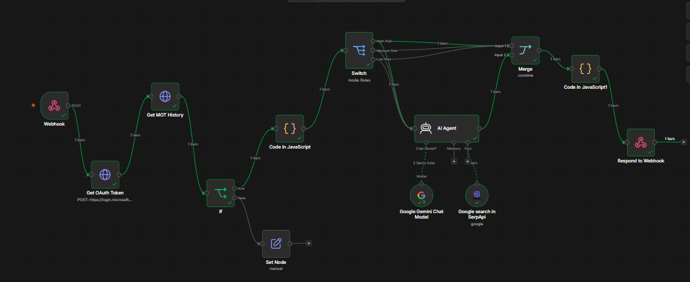
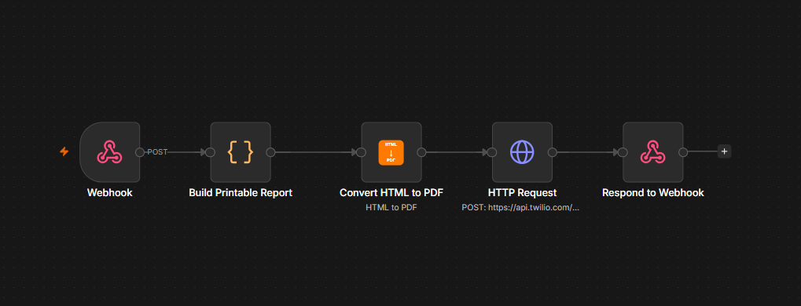
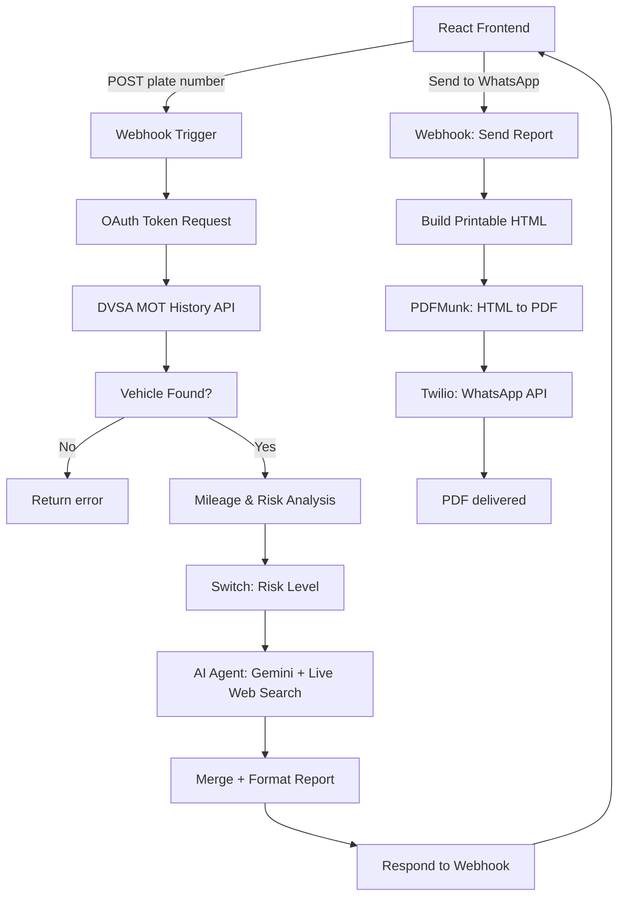
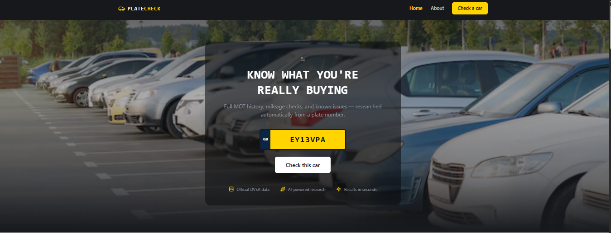
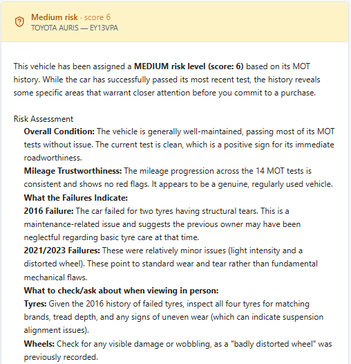

# PlateCheck — AI-Powered UK Vehicle History Checker

An automated due-diligence tool for used car buyers in the UK. Enter a registration
plate, and it pulls the vehicle's official MOT history from DVSA, analyses the
mileage trail for signs of odometer fraud, scores an overall risk level, and then
uses an AI agent — with live web search — to research known issues for that
specific make and model, before writing a plain-English report. Optionally, the
finished report can be sent as a PDF straight to WhatsApp.

## The automation, end to end

| n8n workflow — vehicle check | n8n workflow — WhatsApp send |
|---|---|
|  |  |

---

## Why I built this

Used-car buyers rarely have the time or expertise to properly investigate a
vehicle's history before handing over money. The data used to catch problems
official MOT test records is public, but reading raw test data and knowing what
it actually means for a specific model takes real effort. This project automates
that entire process end to end, with zero manual steps between "here's a plate
number" and "here's a report."

## Architecture



## Tech stack

| Layer | Tools |
|---|---|
| Automation / backend logic | [n8n](https://n8n.io) (self-hosted) |
| Vehicle data | DVSA MOT History API (OAuth2 client credentials) |
| AI reasoning + research | Google Gemini via an n8n AI Agent, with a live web search tool (SerpAPI) |
| PDF generation | PDFMunk API |
| Messaging | Twilio WhatsApp API |
| Frontend | React + Tailwind CSS (Vite) |
| Data storage | Google Sheets |

## What it actually does

1. **Fetches real government data** - not a scraped estimate. Full MOT test
   history, mileage readings, pass/fail results, and defect notes, straight from
   DVSA's official API.
2. **Analyses the mileage trail** - flags mileage decreases (potential clocking)
   and unusually large jumps between tests.
3. **Scores risk** — combines failure count, dangerous defects, and mileage flags
   into a LOW / MEDIUM / HIGH score.
4. **Researches live** - an AI agent decides what to search for, genuinely
   queries the web, and writes a buyer's report combining the hard data with real
   research on known issues for that specific make and model.
5. **Delivers the report** - as a styled web page, and optionally as a PDF sent
   directly to WhatsApp.

## Screenshots

| Home | Report |
|---|---|
|  |  |

## Honest limitations

- Currently self-hosted for demo purposes not deployed to permanent public
  infrastructure.
- The WhatsApp feature uses Twilio's free Sandbox, which requires the recipient
  to have opted in first (a real production version would use a verified
  WhatsApp Business sender).
- Free-tier API quotas (web search, PDF generation) mean heavy simultaneous usage
  could temporarily hit rate limits.
- This is a research aid, not a substitute for a professional vehicle inspection.

## Repo structure

```
├── frontend/          React + Tailwind site
├── n8n-workflows/      Exported n8n workflow JSON (credentials excluded)
├── docs/screenshots/    Images used in this README
└── README.md
```

## Running it yourself

1. Import the JSON files in `n8n-workflows/` into your own n8n instance
2. Add your own credentials for: DVSA MOT History API, Google Gemini, SerpAPI,
   PDFMunk, Twilio, Google Sheets
3. Update the webhook URLs in `frontend/src/App.jsx` to point at your instance
4. `cd frontend && npm install && npm run dev`

---

Built as a portfolio project to demonstrate real agentic AI orchestration —
combining official structured data, live web research, and multi-step
automation into one working product.
